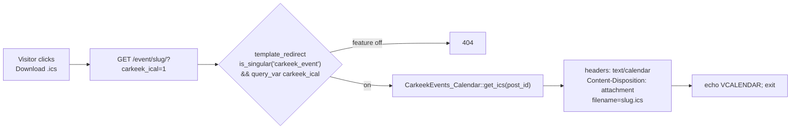

# ✨ feat: Add to Calendar Module (Google + iCal)

> **Implementation status (2026-07-08):** Implemented on branch `feat/add-to-calendar`.
> Verified via PHP lint, `npm run build` (emits `build/add-to-calendar/`), `node --check`,
> and a **standalone `.ics`/Google harness** that confirmed timezone conversion (incl. DST),
> all-day exclusive `DTEND`, `+1h` defaults, RFC 5545 escaping, and 75-octet folding across
> four scenarios. The acceptance-criteria boxes below are the **live-site QA checklist** in the PR
> (no WP-CLI / single target site in this env; real calendar-app import verified during review).

## Overview

Add a single-event **"Add to Calendar"** control to `carkeek-events`, offered two ways
(template helper + a dynamic block), so the plugin covers The Events Calendar's most-requested
calendar feature as part of the 6-month TEC-replacement push (see brainstorm:
`docs/brainstorms/2026-07-08-add-to-calendar-module-brainstorm.md`).

The control renders a native `<details>` disclosure — `[ + Add to Calendar ▾ ]` — expanding to
**Google Calendar** (a URL) and **Download .ics** (a query-var endpoint that streams
`text/calendar`; the same `.ics` serves Apple Calendar and Outlook desktop).

## Decisions Carried From the Brainstorm

All resolved during brainstorming (see brainstorm §Key Decisions / §Resolved Questions):

| Decision | Choice |
|---|---|
| Scope | **Single event only.** No calendar-feed "subscribe" in v1. |
| Services | **Google Calendar + iCal `.ics`.** `.ics` covers Apple + Outlook desktop. Outlook-web deferred. |
| `.ics` delivery | **Query-var endpoint** (`?carkeek_ical=1` on the event permalink) on `template_redirect` — **no rewrite rule, no flush.** |
| UI | **Native `<details>` disclosure** — accessible, no JS. |
| Global toggle | **A settings checkbox** in the existing "Fields in Use" section; gates the block, the endpoint, and the helper output. Default on. |
| Calendar entry body | **Excerpt (fallback trimmed content) + "More info:" link** back to the event permalink. |

Rejected alternatives (brainstorm §Alternatives): inline `data:` URI `.ics` (worse iOS/Apple UX),
pretty rewrite endpoint (reintroduces flush pain), full subscribe feed (bigger; deferred),
third-party JS library (needless dependency).

## Problem Statement / Motivation

TEC's "Add to Calendar / Subscribe" is a sticky feature clients ask for by name. `carkeek-events`
has all the event data (title, ISO start/end, location, content) but no way to emit calendar
links, which blocks TEC migration on sites that rely on it. Building a lean equivalent closes the
gap cheaply and reuses the plugin's existing display-helper + dynamic-block conventions.

## Proposed Solution

A new `CarkeekEvents_Calendar` class owns the calendar logic; a thin `CarkeekEvents_Display`
wrapper preserves the plugin's template-helper convention. A new `carkeek-events/add-to-calendar`
block mirrors the existing event-detail blocks. A "Fields in Use" checkbox gates everything.



## Technical Approach

### Architecture

**New class `includes/class-carkeekevents-calendar.php` (`CarkeekEvents_Calendar`)**

Public API:
- `get_google_url( int $post_id ) : string` — builds
  `https://calendar.google.com/calendar/render?action=TEMPLATE&text=…&dates=…&details=…&location=…`.
  Returns `''` when the event has no start date.
- `get_ics_url( int $post_id ) : string` — `add_query_arg( 'carkeek_ical', '1', get_permalink( $post_id ) )`.
  (This is the brainstorm's "get_ical_url".)
- `get_ics( int $post_id ) : string` — the raw `.ics` text (VCALENDAR/VEVENT), used by the endpoint.
- `render_button( int $post_id, array $args = array() ) : string` — the `<details>` markup.
- `register()` — hooks `query_vars` (register `carkeek_ical`), `template_redirect` (serve `.ics`),
  and `wp_enqueue_scripts` (front-end stylesheet on single events).

**`includes/class-carkeekevents-display.php`** gains:
- `get_add_to_calendar_html( int $post_id, array $args = array() ) : string` — convenience wrapper
  that returns `''` when `field_enabled( 'add_to_calendar' )` is false, else delegates to
  `CarkeekEvents_Calendar::render_button()`. Mirrors `get_event_link_html()` so templates keep using
  `CarkeekEvents_Display::` as the single entry point.
- `get_location_string( int $post_id ) : string` — **new plain-text** location helper (existing
  location helpers return HTML/links). Builds "Name, street, city, state zip" from the linked
  `carkeek_location` meta, or the `_carkeek_event_location_text` fallback. Used for the Google
  `location` param and the `.ics` `LOCATION` field.

### The `.ics` endpoint (query var — no rewrite rule)

```php
// CarkeekEvents_Calendar::register()
add_filter( 'query_vars', fn( $vars ) => array_merge( $vars, array( 'carkeek_ical' ) ) );
add_action( 'template_redirect', array( $instance, 'maybe_serve_ics' ) );

public function maybe_serve_ics() {
    if ( ! is_singular( 'carkeek_event' ) || ! get_query_var( 'carkeek_ical' ) ) {
        return;
    }
    $post_id = get_queried_object_id();
    // Feature gate — 404 when disabled (brainstorm decision).
    if ( ! CarkeekEvents_Display::field_enabled( 'add_to_calendar' ) || post_password_required( $post_id ) ) {
        status_header( 404 );
        return; // let WP render the 404 template
    }
    nocache_headers();
    header( 'Content-Type: text/calendar; charset=utf-8' );
    header( 'Content-Disposition: attachment; filename="' . sanitize_file_name( get_post_field( 'post_name', $post_id ) ?: 'event' ) . '.ics"' );
    echo $this->get_ics( $post_id ); // phpcs:ignore -- text/calendar, escaped per RFC 5545
    exit;
}
```

- **Hidden events (`_carkeek_event_hidden`) still serve `.ics`** — the endpoint sits on the public
  singular permalink and "hidden" only affects archive + search. This matches the "direct link
  works for anyone" contract from the prior feature. No hidden check here.
- Registering `carkeek_ical` as a public query var means `get_query_var()` resolves it on both pretty
  and plain permalinks; `add_query_arg` builds a matching URL for either.

### `.ics` generation & correctness (**the main risk**)

The plugin stores **local** ISO times (`YYYY-MM-DDTHH:MM:SS`); `00:00:00` means "no time" =
**all-day**. Correct output needs timezone + all-day handling:

- **Site timezone** via `wp_timezone()` (a `DateTimeZone`). Parse each local ISO in that zone.
- **Timed event** → emit the absolute instant in **UTC** (`…THHMMSSZ`). Avoids `VTIMEZONE` blocks and
  is DST-correct (we convert a fixed instant). Google `dates` param uses the same UTC `Z` form.
- **All-day event** (start time empty) → `.ics` uses `DTSTART;VALUE=DATE:YYYYMMDD` and an **exclusive**
  `DTEND;VALUE=DATE:<end+1 day>`. Google uses `dates=YYYYMMDD/YYYYMMDD` with the end also +1 day.
- **End resolution** (from `_carkeek_event_end`, which `save_event_meta` defaults to the start *date*):
  - all-day + end date present → multi-day all-day (end = end date + 1 day, exclusive).
  - timed + end time present → use it.
  - timed + no end time → default **end = start + 1 hour** (documented default duration).
  - no end at all → all-day: start + 1 day; timed: start + 1 hour.
- **`.ics` VEVENT fields:** `UID` = `carkeek-event-<post_id>@<site-host>` (stable), `DTSTAMP` (now, UTC),
  `SUMMARY`, `DESCRIPTION`, `LOCATION`, `URL` (permalink).
- **RFC 5545 text rules:** escape `\ ; , ` and newlines (`\n`); **fold lines at 75 octets**; use **CRLF**
  line endings. Helpers: `ics_escape()`, `ics_fold()`.
- **Description** = `get_the_excerpt()` (fallback trimmed `post_content`, HTML stripped) + `\n\nMore info: <permalink>`.

### Google URL specifics

- Base: `https://calendar.google.com/calendar/render?action=TEMPLATE`.
- `text` = title, `dates` = `<start>/<end>` (UTC `Z` for timed, date-only for all-day),
  `details` = description (URL-encoded; **truncate to ~996 chars** per Google's limit — mirror TEC's
  `Google_Calendar::format_event_details_for_url()`), `location` = `get_location_string()`.
- All values `rawurlencode`d; final string passed through `esc_url()` at output.

### The block — `src/add-to-calendar/`

Mirror `src/event-date-time/` exactly:

- **`block.json`** — `apiVersion: 3`, `name: carkeek-events/add-to-calendar`, `icon: calendar-alt`,
  `usesContext: ["postId","postType"]`, `postTypes: ["carkeek_event"]`, `supports: { html: false }`,
  `render: file:./render.php`, `editorScript: file:./index.js`, `style: file:./style-index.css`.
  Attributes: `buttonLabel` (default `"Add to Calendar"`), `googleLabel` (default `"Google Calendar"`),
  `icalLabel` (default `"Download .ics"`).
- **`index.js`** — `registerBlockType( { ...metadata, edit } )` (as `event-date-time/index.js`).
- **`edit.js`** — `ServerSideRender` with `urlQueryArgs={ { postId } }` + an `EmptyResponsePlaceholder`
  ("No date set for this event.") for start-less events; `InspectorControls` with the three label
  `TextControl`s.
- **`render.php`** — resolve `$post_id` (the `$_GET['postId']` REST-preview → `$block->context['postId']`
  → `get_the_ID()` cascade used by `event-details/render.php`), then
  `echo CarkeekEvents_Display::get_add_to_calendar_html( $post_id, $attributes )`.
- **Register:** add `'add-to-calendar'` to `CarkeekEvents_Event_Blocks::$blocks`
  (`includes/class-carkeekevents-event-blocks.php:35`). Registration + the
  `restrict_blocks_to_event_post_type` guard then cover it automatically. Webpack (`wp-scripts`)
  auto-discovers `src/**/block.json`, so `npm run build` emits `build/add-to-calendar/`.

### Settings — one checkbox in "Fields in Use"

- `includes/class-carkeekevents-settings.php`: add `use_add_to_calendar` to the `$fields` array in
  `fields_in_use_callback()` (label: *"Add to Calendar — Google Calendar link and downloadable .ics on
  single events"*) and to `sanitize_settings()` (`! empty()` present-in-form convention, default on).
- No new helper needed: `CarkeekEvents_Display::field_enabled( 'add_to_calendar' )` already maps to
  `use_add_to_calendar` (`class-carkeekevents-display.php` `field_enabled()`).

### Template integration (parity with the existing registration button)

The default single templates already render the registration button via `get_event_link_html()`, so
by parity they render the calendar control too (both gated by their "Fields in Use" toggle):

- `templates/single-carkeek_event.php` — add `CarkeekEvents_Display::get_add_to_calendar_html( $post_id )`
  in the meta area, after the event link.
- `templates/single-carkeek_event-blocks.php` — add it in the **PHP fallback** branch
  (`! has_block( 'carkeek-events/event-details', … )`). Block-editor users place the block explicitly.

### Front-end styles

The block auto-enqueues `style-index.css` when it renders. For the **template-helper** path (no block),
`CarkeekEvents_Calendar::register()` enqueues a small shared stylesheet on `is_singular('carkeek_event')`
(new `assets/css/carkeek-events-frontend.css`). Markup reuses `wp-element-button` (as
`get_event_link_html()` does) so it inherits theme button styling; bespoke CSS is minimal (disclosure
caret + menu spacing).

### Bootstrap

- `carkeek-events.php` `includes()`: `require_once …/class-carkeekevents-calendar.php` and it
  self-registers (`CarkeekEvents_Calendar::register();` at file end, matching sibling classes).

## System-Wide Impact

### Interaction graph
`get_add_to_calendar_html()` → `field_enabled()` gate → `CarkeekEvents_Calendar::render_button()` →
`get_google_url()` + `get_ics_url()` (+ `get_location_string()`). The endpoint path:
`template_redirect` → `maybe_serve_ics()` → `get_ics()` → `ics_escape()`/`ics_fold()`. Block path:
editor `ServerSideRender` → `render.php` → same helper.

### State lifecycle
**No new persisted state** — no new post meta, no options beyond the one settings flag, no DB writes.
The `.ics` is generated per request and never stored, so there is no orphaned/stale-state risk. The
endpoint `exit`s after streaming, so it cannot fall through to other `template_redirect` handlers.

### API surface parity
Three surfaces expose the same output and must stay consistent: the **template helper**, the **block**
(`render.php` calls the helper), and the **default single templates**. All route through
`get_add_to_calendar_html()`, so the field gate + markup are defined once.

### Error / edge propagation
No exceptions expected; `strtotime`/`DateTime` failures on malformed meta return `''` (button hidden)
rather than fataling. The endpoint 404s (not 500s) when disabled, password-protected, or start-less.

### Integration test scenarios (manual QA — no automated suite in this repo)
1. Timed same-day event → `.ics` `DTSTART/DTEND` in UTC; Google `dates` round-trips to the right local time.
2. All-day multi-day event → `VALUE=DATE` with exclusive `DTEND`; Google shows the correct span.
3. Event with commas/newlines/emoji in title+description → escaped + folded; imports cleanly into Google
   and Apple Calendar.
4. Hidden event (`_carkeek_event_hidden`) → `.ics` endpoint still serves (direct link honored).
5. Feature toggle off → block renders nothing, helper returns `''`, endpoint 404s.

## Acceptance Criteria

### Functional
- [ ] A "Fields in Use ▸ Add to Calendar" checkbox exists (default on).
- [ ] `CarkeekEvents_Display::get_add_to_calendar_html( $post_id )` returns a `<details>` control with a
      Google link and a Download-.ics link; returns `''` when the toggle is off or the event has no start.
- [ ] The `carkeek-events/add-to-calendar` block renders the same control on single events and shows an
      empty-state placeholder for start-less events; it is inserter-restricted to `carkeek_event`.
- [ ] `?carkeek_ical=1` on an event permalink streams a valid `.ics` (`text/calendar`, attachment filename
      `<slug>.ics`) that imports into Google Calendar **and** Apple Calendar without errors.
- [ ] Google link opens a prefilled event with correct title, start/end, location, and description+link.
- [ ] Both default single templates render the control (gated by the toggle) for classic and
      block-fallback paths.
- [ ] Hidden events still serve `.ics`; disabled feature 404s the endpoint.

### Non-functional
- [ ] All-day vs timed and single- vs multi-day are timezone-correct (site `wp_timezone()`), including across DST.
- [ ] `.ics` conforms to RFC 5545: CRLF, ≤75-octet folding, escaped `\ ; ,` and newlines, stable `UID`, `DTSTAMP`.
- [ ] The `<details>` control is keyboard- and screen-reader-operable (native element).
- [ ] No rewrite rules added (no flush required on activation/upgrade).

### Quality gates
- [ ] `php -l` clean on all changed/added PHP; `npm run build` emits `build/add-to-calendar/`; `node --check`
      clean on JS.
- [ ] README updated (module, block, endpoint, setting); version bumped; Git Updater headers preserved.

## Dependencies & Risks

- **Timezone / all-day correctness** *(high)* — the primary risk. Mitigated by converting to UTC for timed
  events and `VALUE=DATE` + exclusive `DTEND` for all-day, driven by `wp_timezone()`. Add manual QA across a
  timed event, an all-day multi-day event, and a DST-boundary date.
- **`.ics` escaping/folding** *(medium)* — malformed `.ics` silently fails to import. Centralize in
  `ics_escape()`/`ics_fold()`; test with commas/newlines/unicode.
- **Google `details` length** *(low)* — URLs over Google's limit drop content; truncate to ~996 chars.
- **Template auto-render on upgrade** *(low)* — default-on means upgrading sites show the control on single
  events. Intended (feature-parity push) and opt-out via the toggle; called out here so it is a conscious choice.
- **Password-protected events** *(low)* — endpoint 404s to avoid leaking protected content in the `.ics`.

## Future Considerations (explicitly out of v1 scope)
- Outlook-web link (one more URL on the same data).
- A subscribe/feed `.ics` endpoint for the whole calendar (brainstorm-deferred; needs caching + query logic).
- An `add_to_calendar` **slot** in the events-archive block so cards can carry the control.

## Files Touched
| File | Change |
|---|---|
| `includes/class-carkeekevents-calendar.php` | **new** — URL/ICS builders, `.ics` endpoint, `render_button`, styles enqueue |
| `includes/class-carkeekevents-display.php` | `get_add_to_calendar_html()` wrapper + `get_location_string()` plain-text helper |
| `includes/class-carkeekevents-settings.php` | `use_add_to_calendar` in Fields in Use + sanitize |
| `includes/class-carkeekevents-event-blocks.php` | add `'add-to-calendar'` to `$blocks` |
| `src/add-to-calendar/{block.json,index.js,edit.js,render.php}` | **new** dynamic block |
| `templates/single-carkeek_event.php` | render control (gated) |
| `templates/single-carkeek_event-blocks.php` | render control in PHP-fallback branch (gated) |
| `assets/css/carkeek-events-frontend.css` | **new** minimal front-end styles |
| `carkeek-events.php` | require + bootstrap the calendar class; version bump |
| `README.md` | document module, block, endpoint, setting |

## Sources & References

### Origin
- **Brainstorm:** `docs/brainstorms/2026-07-08-add-to-calendar-module-brainstorm.md` — carried decisions:
  single-event scope, Google + iCal, query-var endpoint (no flush), `<details>` UI, Fields-in-Use toggle,
  excerpt+link body.

### Internal references (file:line)
- Dynamic block pattern to mirror — `src/event-date-time/block.json`, `src/event-date-time/edit.js:36`
  (ServerSideRender), `src/event-details/render.php:26` (postId resolution cascade)
- Block registry + inserter guard — `includes/class-carkeekevents-event-blocks.php:35`, `:60`, `:85`
- Display-helper convention + field gate — `includes/class-carkeekevents-display.php` `get_event_link_html()`,
  `field_enabled()`
- Fields-in-Use settings + sanitize — `includes/class-carkeekevents-settings.php` `fields_in_use_callback()`,
  `sanitize_settings()`
- Single templates — `templates/single-carkeek_event.php`, `templates/single-carkeek_event-blocks.php`
- Meta shape (local ISO, `00:00:00` = all-day) — `includes/class-carkeekevents-meta-boxes.php` `save_event_meta()`

### External references
- TEC Google URL construction (mirrored) — `the-events-calendar/src/Tribe/Views/V2/iCalendar/Links/Google_Calendar.php`
  (`google.com/calendar/render?action=TEMPLATE`, `dates`, `details` ~996-char truncation)
- TEC `.ics`/subscribe design — same dir `Links/iCal.php`, `Links/iCalendar_Export.php`, `Link_Abstract.php`
- RFC 5545 (iCalendar): VEVENT fields, CRLF, 75-octet line folding, TEXT escaping

### Related work
- PR #8 — the field-in-use / hidden-event / editor-mode feature this builds on (`field_enabled()`, the
  two single templates, and the "direct link works" contract for hidden events).
